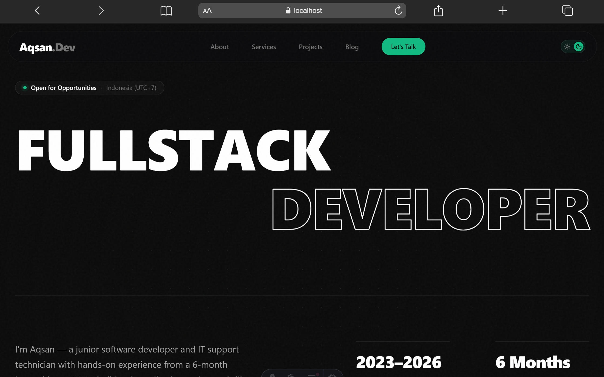

# ⚡ Aqsan.dev — Personal Portfolio & Engineering Space

  **A pragmatic, motion-driven portfolio built with Astro, GSAP, and TypeScript.**

    


---



  
  


## 👨‍💻 About This Project

Hey there! I'm **Muhammad Raffi Aqsan** — a junior software developer and IT support technician from Indonesia.

I wanted a personal website that doesn't feel like another generic template with fake buzzwords. It had to be:

1. **Grounded & Honest** — Reflecting what I actually build (web apps with React, Next.js, Astro, Laravel, Express) and what I've actually done (including a 6-month hands-on industry internship at BRIN).
2. **Fast & Tactile** — Near-instant static page loads powered by Astro, paired with buttery smooth Lenis momentum scrolling and choreographed GSAP motion.
3. **Engineered with Care** — Clean architecture, zero hydration penalty where not needed, strict TypeScript typing, full Schema.org structured data, and zero FOUC on theme switching.

---


## ✨ Features & Highlights

- **⚡ Blazing Fast Architecture (Astro 5 Static)**
Generates lean static HTML for every route. Page navigations feel seamless and app-like thanks to Astro's `<ClientRouter />` view transitions.
- **🎭 Kinetic Motion & Micro-interactions**
  - Smooth inertia scrolling via **Lenis**.
  - Centralized scroll-triggered animations via **GSAP** (`ScrollTrigger`), complete with scroll velocity skews on project cards.
  - Custom fluid magnetic cursor on desktop with touch-safe fallbacks for mobile screens.
- **🌓 Zero-FOUC Dark / Light Theme**
Inline script detects user system preferences or saved `localStorage` values before render, eliminating any white or black flash.
- **🔍 Top-Tier SEO & Rich Results**
  - Automated `sitemap-index.xml` via `@astrojs/sitemap`.
  - Comprehensive Open Graph & Twitter Card previews.
  - Google Knowledge Graph `JSON-LD` (`@graph` combining `Person`, `WebSite`, and `BlogPosting` / `WebPage` schemas).
  - Configured `robots.txt` pointing directly to search engine indexes.
- **📱 Polished Mobile Experience**
  - Full-screen mobile navigation overlay with touch-friendly spacing and dynamic safe-area insets.
  - Auto-hiding header on scroll down for maximum screen real-estate.
- **🛡️ Configurable via** `.env` **(No Hardcoded Personal Links)**
Social media profiles, contact email, phone number, and site canonical URL are decoupled into `.env` using Astro's native `astro:env/client` schema.

---


## 🛠️ Tech Stack


| Layer                         | Technology                                                                                                                                   |
| ----------------------------- | -------------------------------------------------------------------------------------------------------------------------------------------- |
| **Core Framework**            | [Astro 5](https://astro.build/)                                                                                                              |
| **Language**                  | [TypeScript](https://www.typescriptlang.org/)                                                                                                |
| **Styling**                   | Modern CSS with Design Tokens & Glassmorphism                                                                                                |
| **Motion & Scroll**           | [GSAP 3](https://greensock.com/gsap/) + [ScrollTrigger](https://greensock.com/scrolltrigger/) + [Lenis](https://lenis.darkroom.engineering/) |
| **Icons**                     | [astro-icon](https://github.com/natemoo-re/astro-icon) (`lucide` & `simple-icons`)                                                           |
| **SEO & Feed**                | `@astrojs/sitemap`, `@astrojs/rss`, Schema.org JSON-LD                                                                                       |
| **Runtime / Package Manager** | [Bun](https://bun.sh/)                                                                                                                       |


---


## 📂 Project Structure

```text
aqsan-dev/
├── public/
│   ├── images/
│   │   ├── preview.png        # Screenshot preview
│   │   ├── abstract.png       # OpenGraph fallback image
│   │   └── workspace.png
│   ├── favicon.svg
│   └── robots.txt             # Search engine crawler instructions
├── src/
│   ├── components/
│   │   ├── organisms/         # Modular section organisms (Hero, Projects, Blog, About, CTA)
│   │   ├── BlogCard.astro
│   │   ├── Footer.astro
│   │   ├── Header.astro       # Header + mobile navigation
│   │   ├── Preloader.astro    # Initial load visual experience
│   │   ├── ProjectCard.astro
│   │   ├── SmoothCursor.astro # Desktop interactive pointer
│   │   └── ThemeToggle.astro  # Light/Dark mode switcher
│   ├── content/
│   │   ├── blog/              # Markdown blog posts
│   │   └── projects/          # Markdown case studies
│   ├── layouts/
│   │   └── Layout.astro       # Master layout with SEO meta & JSON-LD schema
│   ├── lib/
│   │   └── site.ts            # Environment variables & social link mapper
│   ├── pages/
│   │   ├── about.astro        # Background, story, philosophy & timeline
│   │   ├── blog/              # Blog index & dynamic [slug] article reader
│   │   ├── projects/          # Projects index & dynamic [slug] case studies
│   │   ├── services.astro     # Offerings, capabilities, and FAQ
│   │   └── index.astro        # Homepage
│   └── styles/
│       └── global.css         # Typography, reset, design tokens, utility classes
├── .env.example               # Environment variables template
├── astro.config.mjs           # Astro configuration & type-safe env schema
└── package.json
```

---


## 🚀 Getting Started


### 1. Prerequisites

Make sure you have [Bun](https://bun.sh/) installed (recommended) or Node.js `>= 22.12.0`.

### 2. Clone the Repository

```bash
git clone https://github.com/NojinNojs/aqsan-dev.git
cd aqsan-dev
```


### 3. Install Dependencies

```bash
bun install
```


### 4. Setup Environment Variables

Copy `.env.example` to `.env`:

```bash
cp .env.example .env
```

Open `.env` and fill in your details:

```env
PUBLIC_SITE_URL=https://aqsan.dev
PUBLIC_EMAIL=your-email@example.com
PUBLIC_GITHUB_URL=https://github.com/your-username
PUBLIC_LINKEDIN_URL=https://www.linkedin.com/in/your-profile
PUBLIC_INSTAGRAM_URL=https://www.instagram.com/your-handle
PUBLIC_WHATSAPP=6281234567890
```

> *Tip: Any social field left empty in* `.env` *will automatically hide its corresponding badge/link on the website.*


### 5. Run Local Development Server

```bash
bun run dev
```

Open `http://localhost:4321` in your browser.

---


## 🏗️ Build & Production

To generate the static production build:

```bash
bun run build
```

Output files will be generated in `./dist/`.

To preview the built static site locally:

```bash
bun run preview
```

---


## 🚢 Deployment

This site builds to pure static HTML/CSS/JS and can be deployed anywhere without server runtime requirements:

- **Vercel**: Import repository, framework preset `Astro`, deploy.
- **Netlify**: Connect repository, build command `bun run build`, publish directory `dist`.
- **Cloudflare Pages**: Framework preset `Astro`, build command `bun run build`, output directory `dist`.
- **GitHub Pages**: Use the official Astro GitHub Actions workflow.

*Don't forget to configure your environment variables in your hosting dashboard under Project Settings > Environment Variables.*

---


## 📬 Connect

- **Website**: [aqsan.dev](https://aqsan.dev)
- **GitHub**: [@NojinNojs](https://github.com/NojinNojs)
- **LinkedIn**: [Muhammad Raffi Aqsan](https://www.linkedin.com/in/raffiaqsan/)
- **Email**: [aqsan@proton.me](mailto:aqsan@proton.me)

---

Crafted with focus by Muhammad Raffi Aqsan © 2026. Distributed under the MIT License.